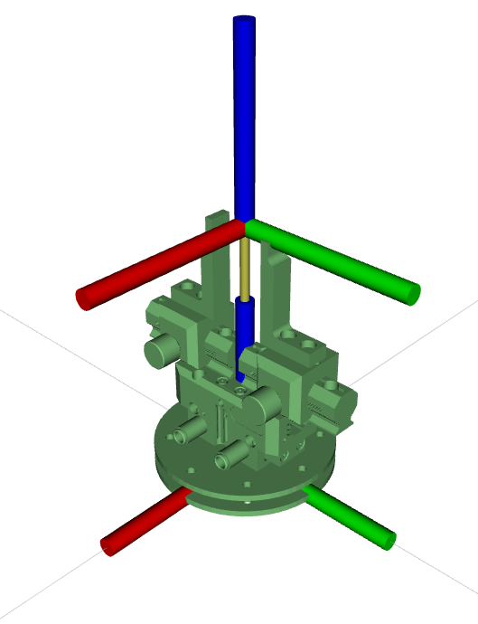
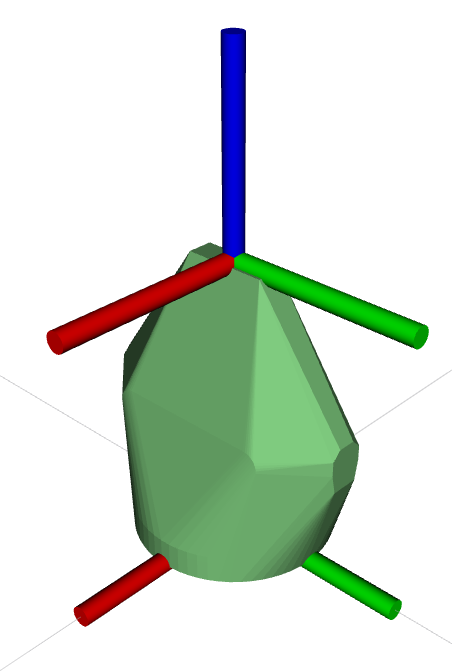

# End Effectors (EEF) - Common Configurations
The default EEF configurations used in the AIMS Lab are included in this folder. Project specific variations of these end-effector configurations should be stored in the project repo, not added to this folder. Only commonly used (or default) configurations should be included here.
 EEF's which are typically used with a specific robot will include the adaptor plate in the mesh file.

| EEF | Robot Typically Paired With | Visual | Collision |
| --- | -------------------- | ------ | --------- |
| Schunk PGN64  | MH5L |    |  |
| Schunk PGN160 | MH50 |  |  |
| Schunk PGN240 | MS210 |  |  |
| Lincoln Electric K3451 Torch Body | MA2010 |  |  |

## ROS-Industrial Tool Reference Frame Convention
End Effectors follow the ROS Enhancement Proposals (REP) - a series of conventions for ROS.

  Tool Reference Frames: [REP-0199 Coordinate Frames for Serial Industrial Manipulators](https://gavanderhoorn.github.io/rep/rep-0199.html)
  Coordinate Frames:     [REP-0103 Standard Units of Measure and Coordinate Conventions](https://www.ros.org/reps/rep-0103.html)

## Usage Guideline

Each end effector is defined in it's own ROS package. To deploy an end effector onto a robot, use the included `$<DESIRED_EEF_PACKAGE>/urdf/<desired_eef>_macro.xacro`. 
